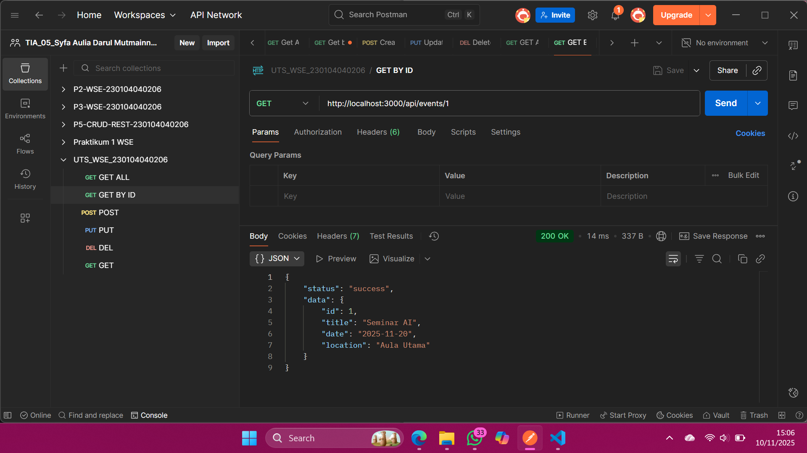
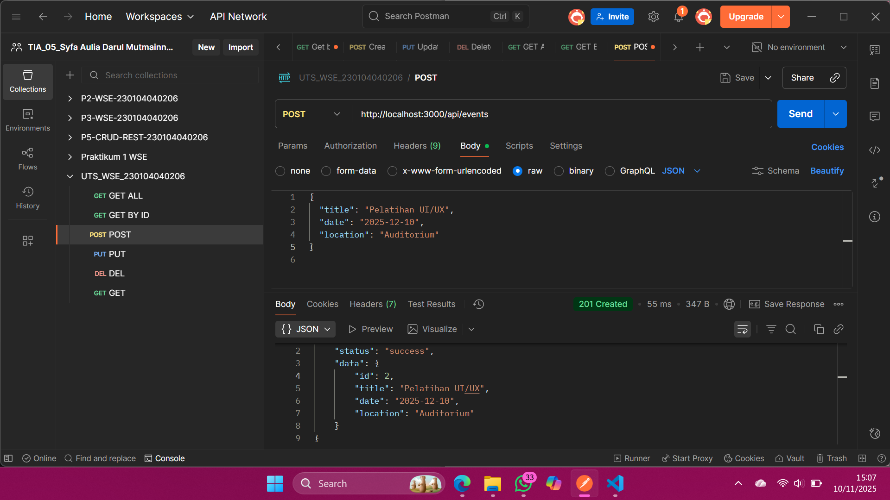
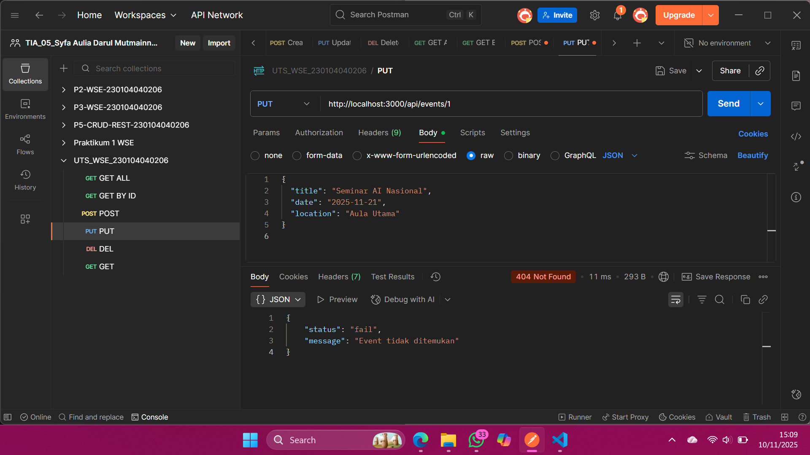
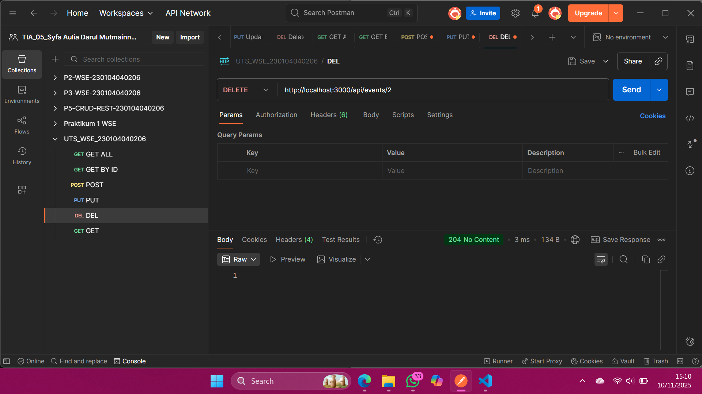
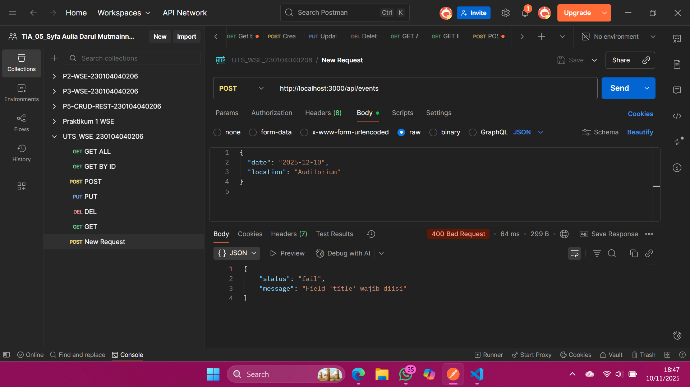

# UTS Web Service Engineering – RESTful API (Events)

## Identitas Mahasiswa
**Nama:** SYFA AULIA DARUL MUTMAINNAH  
**NIM:** 230104040206  
**Kelas:** TI-23A  
**Resource:** events (digit akhir NIM = 6)

---

# 1. Deskripsi Project
Project ini merupakan implementasi RESTful API sederhana menggunakan **Node.js + Express.js** untuk resource **events**, sesuai ketentuan UTS Web Service Engineering.

API ini mendukung operasi CRUD lengkap:
- GET  
- POST  
- PUT  
- DELETE  

Seluruh data disimpan dalam file JavaScript (dummy data), tanpa database.

---

# 2. Teknologi & Tools
- Node.js  
- Express.js  
- Nodemon  
- Postman  
- Visual Studio Code  

---

# 3. Struktur Folder
```
UTS_WSE_230104040206/
│   app.js
│   package.json
│   README.md
│
├── controllers/
│     eventsController.js
│
├── routes/
│     eventsRoutes.js
│
└── data/
      eventsData.js
```

---

# 4. Cara Menjalankan Project

## 1. Install dependency
```
npm install
```

## 2. Jalankan server
```
npm run dev
```

Atau:
```
node app.js
```

Server berjalan pada:
```
http://localhost:3000
```

---

# 5. Daftar Endpoint API

## Base URL:
```
http://localhost:3000/api/events
```

---

## 1. GET All Events
```
GET /api/events
```

Response:
```json
{
  "status": "success",
  "data": [...]
}
```

---

## 2. GET Event by ID
```
GET /api/events/:id
```

Jika ditemukan:
```json
{
  "status": "success",
  "data": {...}
}
```

Jika tidak ada:
```json
{
  "status": "fail",
  "message": "Event tidak ditemukan"
}
```

---

## 3. POST Event (Tambah)
```
POST /api/events
```

Body JSON:
```json
{
  "title": "Pelatihan UI/UX",
  "date": "2025-12-10",
  "location": "Auditorium"
}
```

---

## 4. PUT Event (Update)
```
PUT /api/events/:id
```

Body JSON:
```json
{
  "title": "Seminar AI Nasional",
  "date": "2025-11-21",
  "location": "Aula Utama"
}
```

---

## 5. DELETE Event
```
DELETE /api/events/:id
```

Response berhasil:
- Status code **204 No Content**

---

## 6. API Info
```
GET /api/info
```

Contoh response:
```json
{
  "name": "SYFA AULIA DARUL MUTMAINNAH",
  "nim": "230104040206",
  "resource": "events",
  "message": "RESTful API untuk UTS WSE",
  "time": "2025-11-10T06:30:00.000Z"
}
```

---

# 6. Penerapan 7 RESTful Principles

| Prinsip | Implementasi |
|--------|--------------|
| 1. Resource-Oriented URI | `/api/events` |
| 2. Proper HTTP Methods | GET, POST, PUT, DELETE |
| 3. Stateless | Server tidak menyimpan session |
| 4. Status Codes | 200, 201, 204, 400, 404 |
| 5. JSON Representation | Semua response JSON |
| 6. Validation & Error Handling | Validasi title/date/location |
| 7. Discoverability | Endpoint `/api/info` |

---

# 7. Data Dummy (eventsData.js)

```json
[
  {
    "id": 1,
    "title": "Seminar AI",
    "date": "2025-11-20",
    "location": "Aula Utama"
  },
  {
    "id": 2,
    "title": "Workshop Cyber Security",
    "date": "2025-12-05",
    "location": "Labkom 3"
  }
]
```

---

## Screenshot Hasil Uji (Postman)
Lampirkan 5 screenshot:
### 1. GET Semua Data (GET /api/events)


### 2. GET Data Berdasarkan ID (GET /api/events/1)


### 3. POST Tambah Mahasiswa (POST /api/events)


### 4. PUT Update Mahasiswa (PUT /api/events/3)


### 5. DELETE Hapus Mahasiswa (DELETE /api/events/)


### 6. POST Gagal Tambah Mahasiswa (POST-Gagal /api/events)


---

# 9. Catatan
Project ini dikerjakan tanpa database dan menggunakan data dummy, sesuai ketentuan UTS Web Service Engineering 2025.

